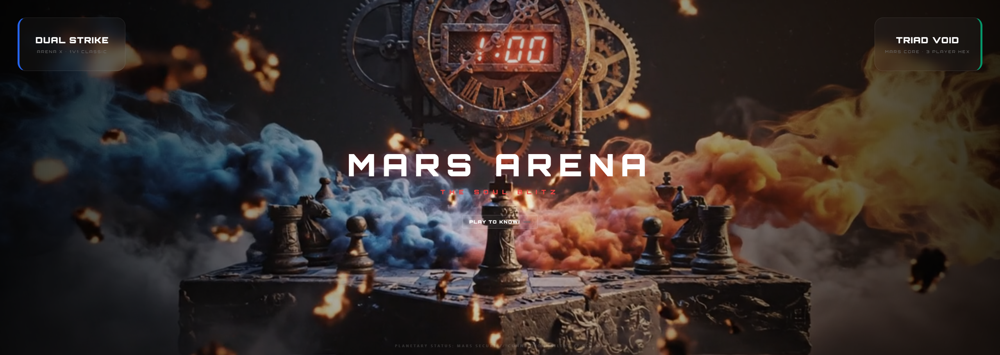
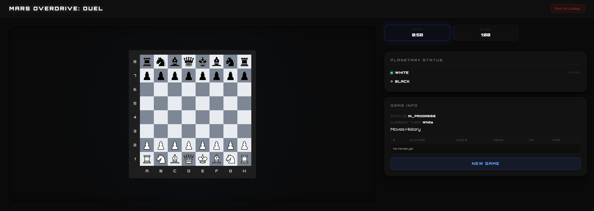
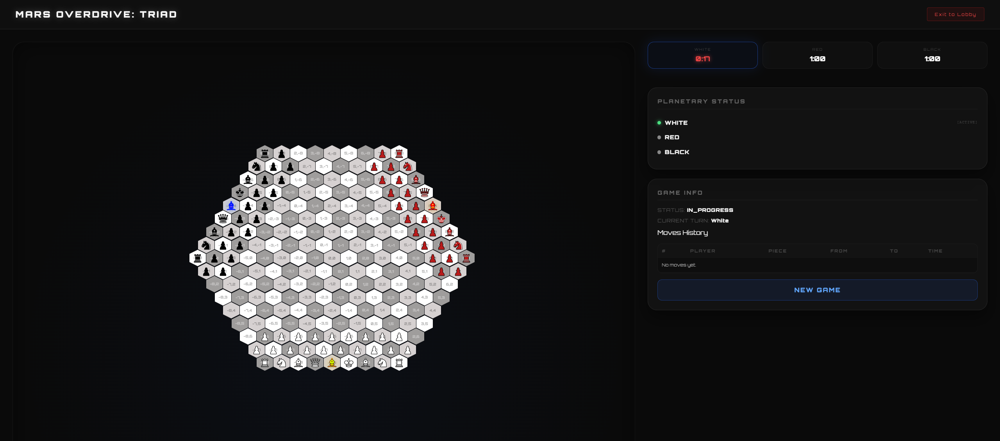

# 🔴 MARS ARENA: THE SOUL BLITZ
### A Full-Stack, Real-Time, Multiplayer 3D Chess Engine


## 📸 Screenshots

<p align="center">
  
  
   
</p>


---

## 🎯 What Is This?

**Mars Arena** is a full-stack multiplayer chess platform that extends classical chess into two non-trivial game modes:

- **Mortal Duel (2-Player):** Classic 8×8 Cartesian chess with authoritative server-side Blitz timing (1-minute per player).
- **The Triad Void (3-Player Hexagonal):** A strategically complex variant on a **Radius-8 hexagonal grid** using **axial coordinates (q, r)**, featuring a custom-designed chess piece — the **Mage**.

The system is built as a **microservices architecture** using Spring Boot backends, a Spring Cloud Gateway, a React frontend, and PostgreSQL — all orchestrated via Docker Compose with a CI/CD pipeline on GitHub Actions.

---

## 💡 The Mage: A Custom Chess Piece

The 3-player mode introduces a novel piece: the **Mage**.

- Moves diagonally like a Bishop, adapted for hexagonal axial geometry.
- On capturing any enemy piece, the Mage triggers a **+5 second Time Siphon** — directly rewarding aggressive tactical play by extending the player's Blitz clock.

This required designing and implementing custom movement algorithms on a non-Cartesian grid, a non-trivial backend engineering problem.

---

## 🛠️ My Contributions

I served as the **Backend Developer and QA Engineer** on this project, working across all microservices — game engine logic, test infrastructure, bug resolution, and code quality.

### 🔧 Backend Logic & Bug Resolution
- Developed and maintained backend logic across all Spring Boot microservices — move validation, collision detection, capture logic, and game state management for both 2-player and 3-player modes.
- Implemented core game engine features in the three-player hexagonal service, including axial coordinate-based movement algorithms and win/loss condition handling.
- Contributed to the Spring Cloud Gateway service for request routing and CORS configuration across the microservices architecture.
- Identified and resolved **critical logic bugs** in the hexagonal chess engine — incorrect move generation on edge-ring tiles of the axial grid that caused illegal moves to be accepted.
- Debugged and fixed state inconsistencies across service boundaries that affected real-time game flow.

### 🧪 Test Suite Architecture
- Designed and implemented the **entire JUnit test suite** for the project — covering both game modes end to end.
- Tests covered: legal move generation, illegal move rejection, capture logic, check/checkmate detection, stalemate conditions, and Mage Time Siphon behavior.
- Wrote integration tests verifying API contract behavior through the Gateway service.

### 🔥 "Ring of Fire" & Clean Code Validation 
- Conducted Ring of Fire testing — systematic checkmate and stalemate detection validation for the hexagonal engine, covering edge cases unique to 3-player axial geometry including radial symmetry and multi-directional threat convergence.
- Applied Clean Code Development principles throughout — SRP, OCP, Law of Demeter — ensuring every backend class had a single clear responsibility and new features didn't break existing verified logic.

### 🧹 Code Quality & Static Analysis
- Worked with **SonarQube/SonarCloud** static analysis reports to eliminate code smells and ensure zero critical vulnerabilities across the backend services.
- Maintained **Grade A** ratings on Reliability, Security, and Maintainability throughout the development cycle.

---

## 🏗️ Architecture

```
                   ┌────────────────────────┐
                   │     webapp-frontend    │
                   │        (React/Vite)    │
                   └─────────────┬──────────┘
                                 │
                                 ▼
                     ┌──────────────────────┐
                     │    gateway-service   │
                     │(Spring Cloud Gateway)│
                     └───────────┬──────────┘
                                 │
         ┌───────────────────────┼────────────────┐
         ▼                       ▼                ▼
┌──────────────────┐  ┌────────────────────┐  ┌─────────────┐
│ two-player-svc   │  │ three-player-svc   │  │  (future)   │
│ (2P logic + API) │  │ (3P logic + API)   │  │             │
└────────┬─────────┘  └─────────┬──────────┘  └─────────────┘
         │                      │
         └──────────┬───────────┘
                    ▼
             ┌────────────┐
             │ PostgreSQL │
             └────────────┘
```

### Services

| Service | Port | Tech |
|---|---|---|
| Gateway | `8080` | Spring Cloud Gateway — routing + CORS |
| Three-Player Service | `8081` | Spring Boot — Axial coordinate hex engine |
| Two-Player Service | `8082` | Spring Boot — Cartesian 8×8 engine |
| Frontend | `5137` | React + Vite |
| Database | `5432` | PostgreSQL — Event Sourcing Lite (move history) |

---

## 📁 Repository Structure

```
root/
├── three-player-chess/     # 3P hex engine (Spring Boot REST API)
├── two-player-chess/       # 2P standard engine (Spring Boot REST API)
├── gateway-service/        # Spring Cloud Gateway
├── webapp-frontend/        # React frontend
└── desktop-application/    # Legacy code reference
```

---

## 🚀 Running Locally

### Prerequisites

- Docker Desktop
- Java 17 (for local development)
- Node.js 21+ (for frontend development)

### One-Command Start

```bash
docker compose up --build
```

| URL | What it is |
|---|---|
| http://localhost:5137 | Game frontend |
| http://localhost:8080 | API Gateway |
| http://localhost:8081/swagger-ui.html | Swagger API docs |

### Run Tests

```bash
./gradlew test
```

---

## ✅ CI/CD Pipeline

Automated via **GitHub Actions** on every push to `main` and `develop`:

- **Gradle test suite** runs on every push — move validation logic is verified before merge.
- **SonarQube static analysis** checks for code smells, vulnerabilities, and technical debt.
- **Docker Buildx** builds and versions all microservice images automatically.
- **Layer caching** keeps build times fast for rapid iteration.

---

## 🧱 Clean Code Principles Applied

| Principle | Implementation |
|---|---|
| **SRP** | Each chess piece is its own class (`Bishop.java`, `Rook.java`, `Mage.java`) — no mixed responsibilities |
| **OCP** | New pieces extend a base class — Mage was added without touching existing engine logic |
| **Law of Demeter** | Frontend communicates via DTOs only; no direct access to internal board structures |
| **Event Sourcing** | Move history stored, not board snapshots — lightweight schema, deterministic state replay |
| **Separation of Concerns** | Chess Core (geometry/rules) fully decoupled from Service Layer (timing, persistence, API) |

---

---

*Developed as a university group project —*  

---


