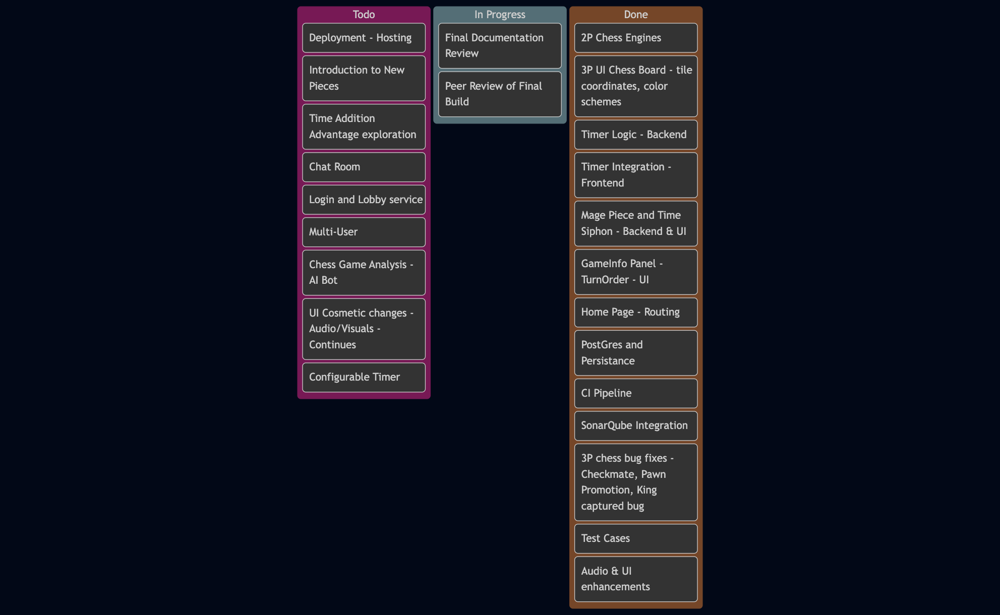
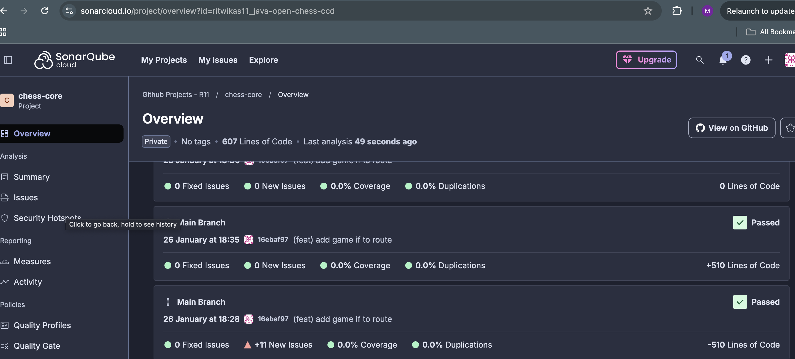
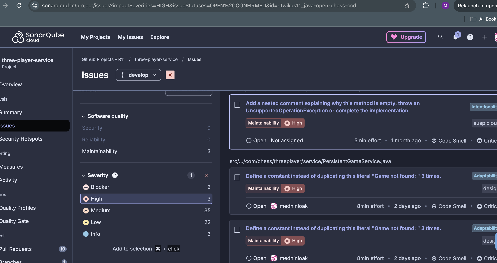

# MARS ARENA: THE SOUL BLITZ
### Clean Code Development - Milestone 2 - Technical Specification

## Project Vision and Core Concept
The objective of "Mars Arena: The Soul Blitz" is to transform traditional chess into a high-intensity competitive environment. The project centers on a strict 1-minute "Blitz" time constraint, demanding high-frequency decision-making and precise execution. 

The system provides a unified experience across two distinct game modes:
1.  **The Triad Void (3-Player Hexagonal):** A complex strategic environment utilizing axial coordinates and a unique Radius-8 hexagonal grid.
2.  **Mortal Duel (2-Player Standard):** A classic 8x8 Cartesian implementation optimized for rapid-fire play.

Both modes share an identical feature set, including authoritative server-side timing, real-time status updates, and move validation.

### New Piece Introduction: The Mage
In the 3-Player Hexagonal mode, we have introduced the **Mage** piece (replacing the central Bishop; instead of 3 Bishops, we've 2 Bishops in this release). The Mage follows the movement patterns of a Bishop but introduces a unique "Time Siphon" mechanic. Upon the successful capture of any enemy piece, the Mage grants the player a +5 second time increment, directly influencing the Blitz clock and rewarding aggressive tactical play.

---

## Team Contributions and Responsibilities

### Ritwika: Frontend Engineering and Process Management
*   **Project Lifecycle Management:** Orchestrated the entire development lifecycle, from initial product ideation and feature specification to final delivery management and milestone synchronization.
*   **UI Development:** Developed the React-based frontend for both the 3-Player Hexagonal board and the 2-Player Standard board.
*   **State Management:** Implemented complex state synchronization to ensure real-time visual updates of pieces, highlights, and legal moves across both coordinate systems (Axial and Cartesian).



### Akshat: Backend Engineering and Game Logic
*   **Chess Core Development:** Engineered the primary game engines for both 3-player and 2-player chess, handling move generation, collision detection, and win/loss condition validation.
*   **Mage Logic Implementation:** Developed the technical specifications, frontend changes and backend logic for the new Mage piece, specifically the diagonal movement algorithms on a hex grid and the capture-triggered time-siphon logic.
*   **Feature Parity:** Ensured that HUD features, including the authoritative clock sync, kill feeds, and the Mars Royalty ranking system, were fully functional and performant in both game dimensions.

### Medhini: System Architecture and DevOps
*   **Infrastructure Orchestration:** Designed and implemented the microservices architecture using Docker Compose, ensuring seamless communication between the Gateway, 2-Player, and 3-Player services.
*   **CI/CD Pipeline:** Configured the automated GitHub Actions workflow to handle continuous integration, build verification, and deployment.
*   **Persistence Layer:** Designed the "Event Sourcing Lite" database schema to store move history and allow for deterministic engine state reconstruction.

### Rakshith: Quality Assurance and System Optimization
*   **Defect Resolution:** Identified and resolved critical logic bugs inherited from the Milestone 1 3-Player implementation, ensuring the stability of the hexagonal engine.
*   **Test Suite Architecture:** Developed comprehensive JUnit test cases for the Chess Core, with a specific focus on edge-case move validations.
*   **Validation Verification:** Conducted rigorous "Ring of Fire" testing to ensure checkmate and stalemate detection logic adhered to formal hexagonal chess rules.

---

## Getting Started

### Prerequisites

- **Docker Desktop** (Required)
- **Java 17** (For local development)
- **Node.js 21+** (For local frontend development)
- **Gradle** (wrapper included: `./gradlew`)

### One-Command Startup

Deploy the entire Mars Arena:

```bash
docker compose up --build
```

- **Arena (Frontend):** [http://localhost:5137](http://localhost:5137)
- **Tactical Gateway:** [http://localhost:8080](http://localhost:8080)
- **API Documentation:** [http://localhost:8081/swagger-ui.html](http://localhost:8081/swagger-ui.html)

---

## Repository Structure

```
root/
├── three-player-chess/         # Three layer chess Chess engine exposed via REST API (Spring Boot)
├── gateway-service/            # API Gateway (Spring Cloud Gateway)
├── webapp-frontend/            # Frontend UI (React)
├── desktop-application/        # Maintains the oldcode
└── two-player-chess/           # Two layer chess Chess engine exposed via REST API (Spring Boot)
```

---

### Component Breakdown

| Service                  | Port   | Responsibility                                                                    |
| :----------------------- | :----- | :-------------------------------------------------------------------------------- |
| **Gateway Service**      | `8080` | Spring Cloud Gateway; handles routing and unified CORS policies.                  |
| **Three-Player Service** | `8081` | Spring Boot; Manages Radius-8 Hexagonal logic using **Axial Coordinates (q, r)**. |
| **Two-Player Service**   | `8082` | Spring Boot; Manages 8x8 Square logic using **Cartesian Coordinates (x, y)**.     |
| **Web Frontend**         | `5137` | React/Vite; Cinematic "Mars HUD" interface.                                       |
| **PostgreSQL**           | `5432` | Persistent storage for move history (Event Sourcing Lite).                        |

---

## Architecture Overview

The system follows a **Microservices Pattern** managed by Docker Compose, ensuring total separation of concerns.

```
                   ┌────────────────────────┐
                   │     webapp-frontend    │
                   │        (React)         │
                   └─────────────┬──────────┘
                                 │
                                 ▼
                     ┌──────────────────────┐
                     │    gateway-service   │
                     │(Spring Cloud Gateway)│
                     └───────────┬──────────┘
                                 │ routes requests
         ┌───────────────────────┼────────────────────────┐
         ▼                       ▼                        ▼
┌──────────────────────┐  ┌────────────────────────┐  ┌──────────────────────┐
│ two-player-service   │  │ three-player-service   │  │ future microservices │
│ (2P logic + API)     │  │ (3P logic + API)       │  │ (tournaments, users) │
└───────────┬──────────┘  └───────────┬────────────┘  └──────────────────────┘
            │                         │
            │(persistence)            │ (persistence)
            ▼                         ▼
        ┌─────────────────────────────────────────────┐
        │                 PostgreSQL                  │
        │                                             │
        └─────────────────────────────────────────────┘

```

---

## CI Pipeline

We utilize **GitHub Actions** for our delivery pipeline (`.github/workflows/ci.yml`):

-   **Automated Quality Assurance:** The pipeline executes a comprehensive Gradle test suite and a SonarQube static analysis scan on every push to the main and develop branches. This ensures that move validation logic and architectural standards are verified before any code is integrated.
-   **Containerized Service Orchestration:** Utilizing Docker Buildx, the workflow automatically generates versioned images for the 3D and 2D Backend, Gateway, and Frontend microservices. 
-   **Build Optimization and Caching:** To maintain high-frequency delivery, the pipeline implements intelligent caching for both SonarQube packages and Docker layers. This significantly reduces build latency, allowing for rapid iteration of game features and bug fixes.

---

## Static Analysis and Code Quality

To ensure architectural integrity and adherence to industry standards, Mars Overdrive integrated **SonarQube/SonarCloud** into the CI/CD pipeline. This automated analysis provides continuous monitoring of the codebase for technical debt, security vulnerabilities, and logic flaws.

### Technical Performance Metrics
The system consistently maintains high-tier ratings across the three primary pillars of software quality:
*   **Reliability:** Grade A (Zero critical bugs detected)
*   **Security:** Grade A (Zero vulnerabilities or security hotspots identified)
*   **Maintainability:** Grade A (Minimal technical debt)

### Quality Gate and Coverage Status
During the initial development of the core engine, the project maintained a "Passed" status on all quality gates. As the system expanded into a microservices architecture for Milestone 2, the automated Quality Gate on our SonarCloud instance moved to a "Failed" state.



It is important to note the technical context of this status:
1.  **Metric-Based Thresholds:** The failure is triggered by the default enterprise-level threshold for test coverage (typically 80%). It is not a reflection of code safety, logic errors, or functional defects.
2.  **Subscription Constraints:** Due to limitations within the SonarCloud free tier for private repositories, customization of Quality Gate parameters is restricted. We are unable to reconfigure the gate to align with our specific iterative testing strategy for student projects.
3.  **Core Quality Stability:** Despite the automated gate status, the static analysis engine continues to confirm that all existing code follows best practices with **zero vulnerabilities and zero critical code smells**.



The team continues to utilize the static analysis reports to ensure that every new feature—including the microservice gateway and Mage logic—remains technically sound and production-ready.

---

**Run Tests:**

```bash
./gradlew test
```

---

## Clean Code Development (CCD) Principles

The architecture of Mars Arena adheres to modern software engineering standards to ensure extensibility, maintainability, and architectural clarity.

### Modular Piece Architecture (SRP & OCP)
A core design decision was the strict separation of piece logic into individual classes (e.g., separate files for `Bishop.java`, `Rook.java`, and `Mage.java`). While these pieces may share similar sliding mechanics, keeping them distinct serves two critical purposes:
*   **Single Responsibility Principle (SRP):** Each class is responsible for the unique movement rules of a single piece type. Mixing these behaviors into a single generic "sliding piece" class would introduce complex conditional logic, making the code harder to read and test.
*   **Open/Closed Principle (OCP):** By using a polymorphic approach where every piece extends a base class, we can introduce entirely new pieces—such as the **Mage**—without modifying existing, verified logic. This ensures that new features do not introduce regressions into the core engine.

### Separation of Concerns
We established a clear boundary between the **Chess Core** (pure geometric rules and coordinate mathematics) and the **Service Layer** (persistence, timing, and API orchestration). This allows the engine to remain stateless and deterministic, while the service handles the complexities of real-time Blitz game management and database integrity.

### Law of Demeter and Data Encapsulation
To prevent tight coupling between the frontend UI and the backend data structures, we implemented strict encapsulation:
*   Components communicate through minimalist **Data Transfer Objects (DTOs)**.
*   Frontend logic utilizes helper functions (e.g., `getPieceTypeAt`) to access state, ensuring that the UI does not need intimate knowledge of the internal tile or piece object hierarchies.

### Persistence via Event Sourcing Lite
Instead of storing heavy snapshots of the board state, we utilize an **Event Sourcing** pattern by persisting the history of moves. This approach ensures:
*   **Data Integrity:** The game state can always be deterministically reconstructed from the beginning.
*   **KISS (Keep It Simple, Stupid):** The database schema remains lightweight and easy to migrate using Flyway, avoiding the storage of complex, nested objects.

---

### Future Roadmap
The Mars Arena architecture is designed for continuous expansion. Future development cycles will prioritize the following technical milestones:
### Infrastructure and Multi-User Support
*  **Cloud Deployment and Production Hosting:** Migration from local Docker orchestration to cloud-native environments for global accessibility.
*  **Identity Management and Matchmaking:** Implementation of a dedicated Login and Lobby service to facilitate persistent user accounts and multi-user sessions.
### Gameplay Evolution
*  **Tactical Library Expansion:** Introduction of additional unique piece types with specialized movement and capture rules to complement the Mage.
*  **Advanced Time-Control Mechanics:** Development of configurable match timers and specialized time-addition advantage rules for varied competitive formats.
### Intelligence and Social Integration
* **Engine-Driven Game Analysis:** Integration of an AI Bot to provide post-match tactical evaluation and automated gameplay training.
* **Real-Time Communication:** Deployment of a dedicated Chat Room service to allow player interaction during active matches.
### Cinematic Fidelity
* **Audio-Visual Iteration:** Continuous enhancement of the UI through high-fidelity visual effects and dynamic soundscapes to strengthen the Mars Overdrive aesthetic.

---
**Developed by Team Mars.**
